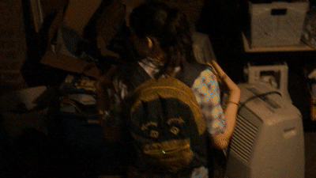
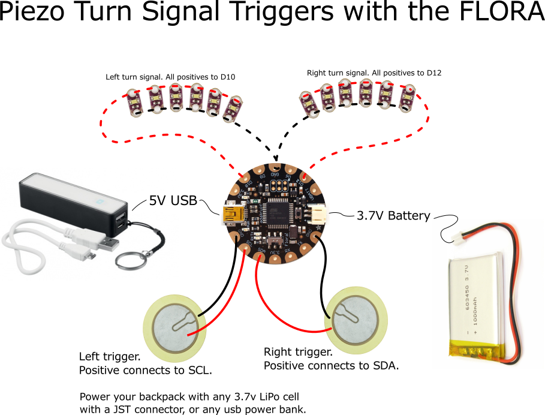
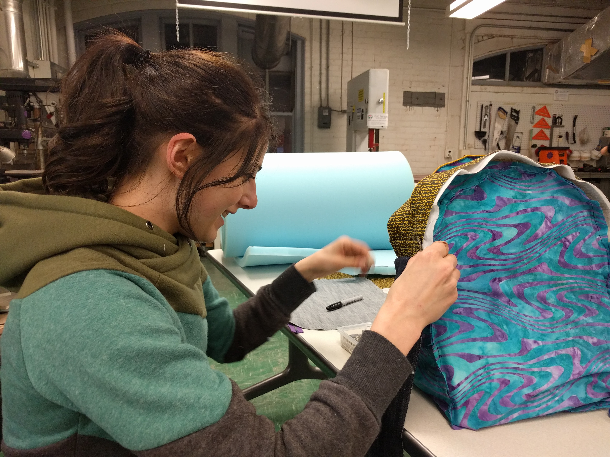
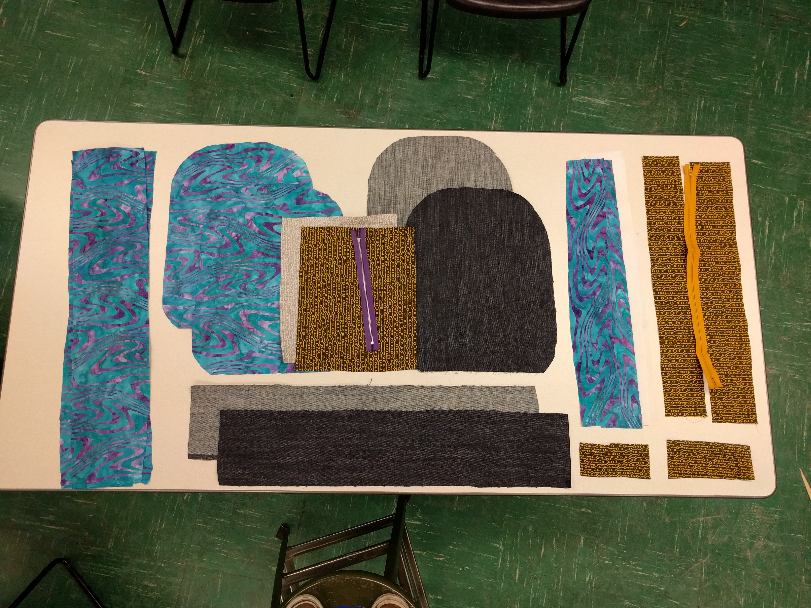

# backpackinterrupt
Schematic and code for a piezo triggered turn signal project.

Jessica Nelson ideated and sewed the backpack. Colten Jackson wrote the code.

The backpack uses Adafruit Flora and sewable LEDs. The LEDs are sewn in with stainless steel thread. The piezos in the backpack straps trigger hardware interrupts (That is, when an electric spike a.k.a. rising edge hits the Flora's SDA or SCL pins, it immediately triggers a function to blink.)

The timing compares how long ago a turn was triggered against the system time using millis(). If one of the triggers was struck within the last 2 seconds, whatever trigger was most recent blinks an led, checks if its still been less than 2 seconds, and blinks again.

SDA and SCL are hardware inturrupts number 0 and 1 on the ATMEGA32u4 that the FLORA is based on, and attachInterrupt is used in the code for these two triggers.

Most schematics for piezo triggers include a large resistor between the sense pin and ground to protect the Flora, and while we've skipped that step to keep the wiring simple, you may wish to include these resistros in your own design.

The next steps for this project might include an audible indicator that the signal is functioning, since the user doesn't really have any feedback of blinker getting triggered.

This will be the build for a summer camp at Champaign Urbana Community Fab Lab in 2016. Kids who've already taken the intro to sewing camp will make a backpack with their choice of fabric and embroidered embellishments and will then outfit their bag with a FLORA microcontroller.

Video is on YouTube:

